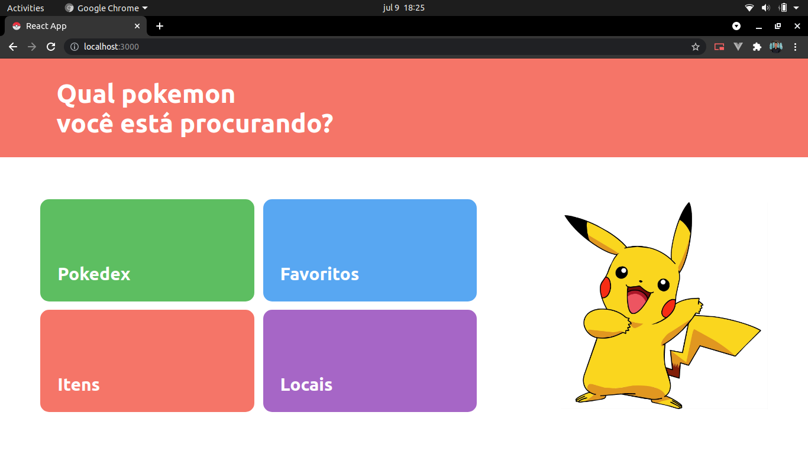

# Pokedex
Pokedex usando a PokeAPI onde é possível ver todos os pokemons, itens, locais e seus pokemons favoritos.
Ao clicar em algum card do pokemon ou do item temos algums detalhes sobre eles e para favoritar um pokemon basta clicar no <3.


## Como rodar o projeto

### Requisitos
Tenha o Node na versão ≥ 10.15 instalado em seu computador.
Com o Node instalado siga o passo a passo abaixo ;)

1. Baixe o repositório, para isso você pode baixar o .zip ou então pelo comando
```bash
git clone https://github.com/custodiomatheus/pokedex.git
```

3. Acesse a pasta front entrando na pasta pokedex e então front ou então pelos comandos
```bash
cd pokedex
cd front
```

4. Rode o comando abaixo para realizar instalar de todas as dependências do projeto
```bash
npm install
```
PS: isso pode levar alguns segundos....

5. Para finalizar, rode o comando abaixo para iniciar o projeto
```bash
npm start
```


